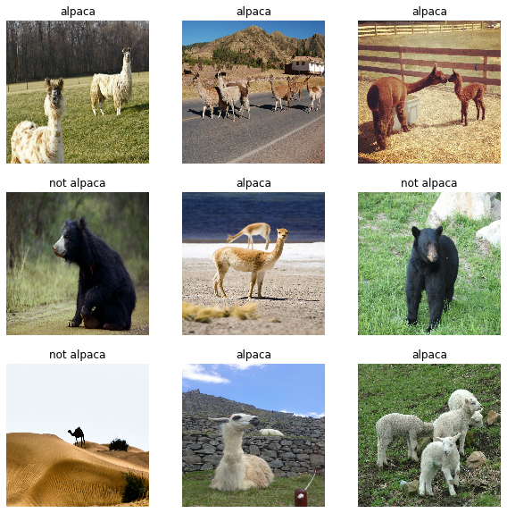
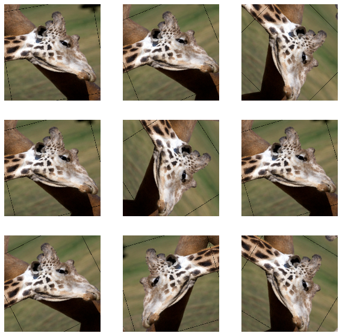
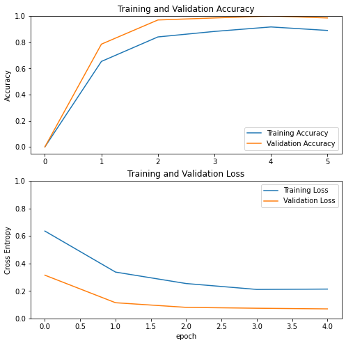
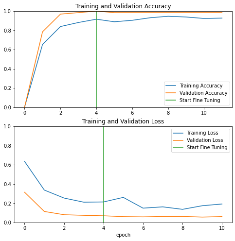

# Transfer Learning with MobileNetV2

Welcome to this week's assignment, where you'll be using transfer learning on a pre-trained CNN to build an Alpaca/Not Alpaca classifier!


A pre-trained model is a network that's already been trained on a large dataset and saved, which allows you to use it to customize your own model cheaply and efficiently. The one you'll be using, MobileNetV2, was designed to provide fast and computationally efficient performance. It's been pre-trained on ImageNet, a dataset containing over 14 million images and 1000 classes.

By the end of this assignment, you will be able to:

- Create a dataset from a directory
- Preprocess and augment data using the Sequential API
- Adapt a pretrained model to new data and train a classifier using the Functional API and MobileNet
- Fine-tune a classifier's final layers to improve accuracy 

## Table of Content

- [1 - Packages](#1)
    - [1.1 Create the Dataset and Split it into Training and Validation Sets](#1-1)
- [2 - Preprocess and Augment Training Data](#2)
    - [Exercise 1 - data_augmenter](#ex-1)
- [3 - Using MobileNetV2 for Transfer Learning](#3)
    - [3.1 - Inside a MobileNetV2 Convolutional Building Block](#3-1)
    - [3.2 - Layer Freezing with the Functional API](#3-2)
        - [Exercise 2 - alpaca_model](#ex-2)
    - [3.3 - Fine-tuning the Model](#3-3)
        - [Exercise 3](#ex-3)

<a name='1'></a>
## 1 - Packages


```python
import matplotlib.pyplot as plt
import numpy as np
import os
import tensorflow as tf
import tensorflow.keras.layers as tfl

from tensorflow.keras.preprocessing import image_dataset_from_directory
from tensorflow.keras.layers.experimental.preprocessing import RandomFlip, RandomRotation

```

<a name='1-1'></a>
### 1.1 Create the Dataset and Split it into Training and Validation Sets

When training and evaluating deep learning models in Keras, generating a dataset from image files stored on disk is simple and fast. Call `image_data_set_from_directory()` to read from the directory and create both training and validation datasets. 

If you're specifying a validation split, you'll also need to specify the subset for each portion. Just set the training set to `subset='training'` and the validation set to `subset='validation'`.

You'll also set your seeds to match each other, so your training and validation sets don't overlap. :) 


```python
BATCH_SIZE = 32
IMG_SIZE = (160, 160)
directory = "dataset/"
train_dataset = image_dataset_from_directory(directory,
                                             shuffle=True,
                                             batch_size=BATCH_SIZE,
                                             image_size=IMG_SIZE,
                                             validation_split=0.2,
                                             subset='training',
                                             seed=42)
validation_dataset = image_dataset_from_directory(directory,
                                             shuffle=True,
                                             batch_size=BATCH_SIZE,
                                             image_size=IMG_SIZE,
                                             validation_split=0.2,
                                             subset='validation',
                                             seed=42)
```

    Found 327 files belonging to 2 classes.
    Using 262 files for training.
    Found 327 files belonging to 2 classes.
    Using 65 files for validation.


Now let's take a look at some of the images from the training set: 


```python
class_names = train_dataset.class_names

plt.figure(figsize=(10, 10))
for images, labels in train_dataset.take(1):
    for i in range(9):
        ax = plt.subplot(3, 3, i + 1)
        plt.imshow(images[i].numpy().astype("uint8"))
        plt.title(class_names[labels[i]])
        plt.axis("off")
```





<a name='2'></a>
## 2 - Preprocess and Augment Training Data

You may have encountered `dataset.prefetch` in a previous TensorFlow assignment, as an important extra step in data preprocessing. 

Using `prefetch()` prevents a memory bottleneck that can occur when reading from disk. It sets aside some data and keeps it ready for when it's needed, by creating a source dataset from your input data, applying a transformation to preprocess it, then iterating over the dataset one element at a time. Because the iteration is streaming, the data doesn't need to fit into memory.

You can set the number of elements to prefetch manually, or you can use `tf.data.experimental.AUTOTUNE` to choose the parameters automatically. Autotune prompts `tf.data` to tune that value dynamically at runtime, by tracking the time spent in each operation and feeding those times into an optimization algorithm. The optimization algorithm tries to find the best allocation of its CPU budget across all tunable operations. 

To increase diversity in the training set and help your model learn the data better, it's standard practice to augment the images by transforming them, i.e., randomly flipping and rotating them. Keras' Sequential API offers a straightforward method for these kinds of data augmentations, with built-in, customizable preprocessing layers. These layers are saved with the rest of your model and can be re-used later.  Ahh, so convenient! 

As always, you're invited to read the official docs, which you can find for data augmentation [here](https://www.tensorflow.org/tutorials/images/data_augmentation).


```python
AUTOTUNE = tf.data.experimental.AUTOTUNE
train_dataset = train_dataset.prefetch(buffer_size=AUTOTUNE)
```

<a name='ex-1'></a>
### Exercise 1 - data_augmenter

Implement a function for data augmentation. Use a `Sequential` keras model composed of 2 layers:
* `RandomFlip('horizontal')`
* `RandomRotation(0.2)`


```python
# GRADED FUNCTION: data_augmenter
def data_augmenter():
    '''
    Create a Sequential model composed of 2 layers
    Returns:
        tf.keras.Sequential
    '''
    # data_augmentation = None
    # data_augmentation.add(None)
    # data_augmentation.add(None)
    # YOUR CODE STARTS HERE
    data_augmentation = tf.keras.Sequential([
  tfl.experimental.preprocessing.RandomFlip("horizontal"),
  tfl.experimental.preprocessing.RandomRotation(0.2),
])
    # YOUR CODE ENDS HERE
    
    return data_augmentation
```


```python
augmenter = data_augmenter()

assert(augmenter.layers[0].name.startswith('random_flip')), "First layer must be RandomFlip"
assert augmenter.layers[0].mode == 'horizontal', "RadomFlip parameter must be horizontal"
assert(augmenter.layers[1].name.startswith('random_rotation')), "Second layer must be RandomRotation"
assert augmenter.layers[1].factor == 0.2, "Rotation factor must be 0.2"
print('\033[92mAll tests passed!')

```

    All tests passed!


Take a look at how an image from the training set has been augmented with simple transformations:

From one cute animal, to 9 variations of that cute animal, in three lines of code. Now your model has a lot more to learn from.


```python
data_augmentation = data_augmenter()

for image, _ in train_dataset.take(1):
    plt.figure(figsize=(10, 10))
    first_image = image[0]
    for i in range(9):
        ax = plt.subplot(3, 3, i + 1)
        augmented_image = data_augmentation(tf.expand_dims(first_image, 0))
        plt.imshow(augmented_image[0] / 255)
        plt.axis('off')
```





Next, you'll apply your first tool from the MobileNet application in TensorFlow, to normalize your input. Since you're using a pre-trained model that was trained on the normalization values [-1,1], it's best practice to reuse that standard with tf.keras.applications.mobilenet_v2.preprocess_input.

<font color = 'blue'>

**What you should remember:**

* When calling image_data_set_from_directory(), specify the train/val subsets and match the seeds to prevent overlap
* Use prefetch() to prevent memory bottlenecks when reading from disk
* Give your model more to learn from with simple data augmentations like rotation and flipping.
* When using a pretrained model, it's best to reuse the weights it was trained on.


```python
preprocess_input = tf.keras.applications.mobilenet_v2.preprocess_input
```

<a name='3'></a>
## 3 - Using MobileNetV2 for Transfer Learning 

MobileNetV2 was trained on ImageNet and is optimized to run on mobile and other low-power applications. It's 155 layers deep (just in case you felt the urge to plot the model yourself, prepare for a long journey!) and very efficient for object detection and image segmentation tasks, as well as classification tasks like this one. The architecture has three defining characteristics:

*   Depthwise separable convolutions
*   Thin input and output bottlenecks between layers
*   Shortcut connections between bottleneck layers

<a name='3-1'></a>
### 3.1 - Inside a MobileNetV2 Convolutional Building Block

MobileNetV2 uses depthwise separable convolutions as efficient building blocks. Traditional convolutions are often very resource-intensive, and  depthwise separable convolutions are able to reduce the number of trainable parameters and operations and also speed up convolutions in two steps: 

1. The first step calculates an intermediate result by convolving on each of the channels independently. This is the depthwise convolution.

2. In the second step, another convolution merges the outputs of the previous step into one. This gets a single result from a single feature at a time, and then is applied to all the filters in the output layer. This is the pointwise convolution, or: **Shape of the depthwise convolution X Number of filters.**


<caption><center> <u> <font color='purple'> <b>Figure 1</b> </u><font color='purple'>  : <b>MobileNetV2 Architecture</b> <br> This diagram was inspired by the original seen <a href="https://ai.googleblog.com/2018/04/mobilenetv2-next-generation-of-on.html#:~:text=MobileNetV2%20is%20a%20significant%20improvement,object%20detection%20and%20semantic%20segmentation.">here</a>.</center></caption>

Each block consists of an inverted residual structure with a bottleneck at each end. These bottlenecks encode the intermediate inputs and outputs in a low dimensional space, and prevent non-linearities from destroying important information. 

The shortcut connections, which are similar to the ones in traditional residual networks, serve the same purpose of speeding up training and improving predictions. These connections skip over the intermediate convolutions and connect the bottleneck layers. 

Let's try to train your base model using all the layers from the pretrained model. 

Similarly to how you reused the pretrained normalization values MobileNetV2 was trained on, you'll also load the pretrained weights from ImageNet by specifying `weights='imagenet'`. 


```python
IMG_SHAPE = IMG_SIZE + (3,)
base_model = tf.keras.applications.MobileNetV2(input_shape=IMG_SHAPE,
                                               include_top=True,
                                               weights='imagenet')
```

Print the model summary below to see all the model's layers, the shapes of their outputs, and the total number of parameters, trainable and non-trainable. 


```python
base_model.summary()
```

    Model: "mobilenetv2_1.00_160"
    __________________________________________________________________________________________________
    Layer (type)                    Output Shape         Param #     Connected to                     
    ==================================================================================================
    input_1 (InputLayer)            [(None, 160, 160, 3) 0                                            
    __________________________________________________________________________________________________
    Conv1_pad (ZeroPadding2D)       (None, 161, 161, 3)  0           input_1[0][0]                    
    __________________________________________________________________________________________________
    Conv1 (Conv2D)                  (None, 80, 80, 32)   864         Conv1_pad[0][0]                  
    __________________________________________________________________________________________________
    bn_Conv1 (BatchNormalization)   (None, 80, 80, 32)   128         Conv1[0][0]                      
    __________________________________________________________________________________________________
    Conv1_relu (ReLU)               (None, 80, 80, 32)   0           bn_Conv1[0][0]                   
    __________________________________________________________________________________________________
    expanded_conv_depthwise (Depthw (None, 80, 80, 32)   288         Conv1_relu[0][0]                 
    __________________________________________________________________________________________________
    expanded_conv_depthwise_BN (Bat (None, 80, 80, 32)   128         expanded_conv_depthwise[0][0]    
    __________________________________________________________________________________________________
    expanded_conv_depthwise_relu (R (None, 80, 80, 32)   0           expanded_conv_depthwise_BN[0][0] 
    __________________________________________________________________________________________________
    expanded_conv_project (Conv2D)  (None, 80, 80, 16)   512         expanded_conv_depthwise_relu[0][0
    __________________________________________________________________________________________________
    expanded_conv_project_BN (Batch (None, 80, 80, 16)   64          expanded_conv_project[0][0]      
    __________________________________________________________________________________________________
    block_1_expand (Conv2D)         (None, 80, 80, 96)   1536        expanded_conv_project_BN[0][0]   
    __________________________________________________________________________________________________
    block_1_expand_BN (BatchNormali (None, 80, 80, 96)   384         block_1_expand[0][0]             
    __________________________________________________________________________________________________
    block_1_expand_relu (ReLU)      (None, 80, 80, 96)   0           block_1_expand_BN[0][0]          
    __________________________________________________________________________________________________
    block_1_pad (ZeroPadding2D)     (None, 81, 81, 96)   0           block_1_expand_relu[0][0]        
    __________________________________________________________________________________________________
    block_1_depthwise (DepthwiseCon (None, 40, 40, 96)   864         block_1_pad[0][0]                
    __________________________________________________________________________________________________
    block_1_depthwise_BN (BatchNorm (None, 40, 40, 96)   384         block_1_depthwise[0][0]          
    __________________________________________________________________________________________________
    block_1_depthwise_relu (ReLU)   (None, 40, 40, 96)   0           block_1_depthwise_BN[0][0]       
    __________________________________________________________________________________________________
    block_1_project (Conv2D)        (None, 40, 40, 24)   2304        block_1_depthwise_relu[0][0]     
    __________________________________________________________________________________________________
    block_1_project_BN (BatchNormal (None, 40, 40, 24)   96          block_1_project[0][0]            
    __________________________________________________________________________________________________
    block_2_expand (Conv2D)         (None, 40, 40, 144)  3456        block_1_project_BN[0][0]         
    __________________________________________________________________________________________________
    block_2_expand_BN (BatchNormali (None, 40, 40, 144)  576         block_2_expand[0][0]             
    __________________________________________________________________________________________________
    block_2_expand_relu (ReLU)      (None, 40, 40, 144)  0           block_2_expand_BN[0][0]          
    __________________________________________________________________________________________________
    block_2_depthwise (DepthwiseCon (None, 40, 40, 144)  1296        block_2_expand_relu[0][0]        
    __________________________________________________________________________________________________
    block_2_depthwise_BN (BatchNorm (None, 40, 40, 144)  576         block_2_depthwise[0][0]          
    __________________________________________________________________________________________________
    block_2_depthwise_relu (ReLU)   (None, 40, 40, 144)  0           block_2_depthwise_BN[0][0]       
    __________________________________________________________________________________________________
    block_2_project (Conv2D)        (None, 40, 40, 24)   3456        block_2_depthwise_relu[0][0]     
    __________________________________________________________________________________________________
    block_2_project_BN (BatchNormal (None, 40, 40, 24)   96          block_2_project[0][0]            
    __________________________________________________________________________________________________
    block_2_add (Add)               (None, 40, 40, 24)   0           block_1_project_BN[0][0]         
                                                                     block_2_project_BN[0][0]         
    __________________________________________________________________________________________________
    block_3_expand (Conv2D)         (None, 40, 40, 144)  3456        block_2_add[0][0]                
    __________________________________________________________________________________________________
    block_3_expand_BN (BatchNormali (None, 40, 40, 144)  576         block_3_expand[0][0]             
    __________________________________________________________________________________________________
    block_3_expand_relu (ReLU)      (None, 40, 40, 144)  0           block_3_expand_BN[0][0]          
    __________________________________________________________________________________________________
    block_3_pad (ZeroPadding2D)     (None, 41, 41, 144)  0           block_3_expand_relu[0][0]        
    __________________________________________________________________________________________________
    block_3_depthwise (DepthwiseCon (None, 20, 20, 144)  1296        block_3_pad[0][0]                
    __________________________________________________________________________________________________
    block_3_depthwise_BN (BatchNorm (None, 20, 20, 144)  576         block_3_depthwise[0][0]          
    __________________________________________________________________________________________________
    block_3_depthwise_relu (ReLU)   (None, 20, 20, 144)  0           block_3_depthwise_BN[0][0]       
    __________________________________________________________________________________________________
    block_3_project (Conv2D)        (None, 20, 20, 32)   4608        block_3_depthwise_relu[0][0]     
    __________________________________________________________________________________________________
    block_3_project_BN (BatchNormal (None, 20, 20, 32)   128         block_3_project[0][0]            
    __________________________________________________________________________________________________
    block_4_expand (Conv2D)         (None, 20, 20, 192)  6144        block_3_project_BN[0][0]         
    __________________________________________________________________________________________________
    block_4_expand_BN (BatchNormali (None, 20, 20, 192)  768         block_4_expand[0][0]             
    __________________________________________________________________________________________________
    block_4_expand_relu (ReLU)      (None, 20, 20, 192)  0           block_4_expand_BN[0][0]          
    __________________________________________________________________________________________________
    block_4_depthwise (DepthwiseCon (None, 20, 20, 192)  1728        block_4_expand_relu[0][0]        
    __________________________________________________________________________________________________
    block_4_depthwise_BN (BatchNorm (None, 20, 20, 192)  768         block_4_depthwise[0][0]          
    __________________________________________________________________________________________________
    block_4_depthwise_relu (ReLU)   (None, 20, 20, 192)  0           block_4_depthwise_BN[0][0]       
    __________________________________________________________________________________________________
    block_4_project (Conv2D)        (None, 20, 20, 32)   6144        block_4_depthwise_relu[0][0]     
    __________________________________________________________________________________________________
    block_4_project_BN (BatchNormal (None, 20, 20, 32)   128         block_4_project[0][0]            
    __________________________________________________________________________________________________
    block_4_add (Add)               (None, 20, 20, 32)   0           block_3_project_BN[0][0]         
                                                                     block_4_project_BN[0][0]         
    __________________________________________________________________________________________________
    block_5_expand (Conv2D)         (None, 20, 20, 192)  6144        block_4_add[0][0]                
    __________________________________________________________________________________________________
    block_5_expand_BN (BatchNormali (None, 20, 20, 192)  768         block_5_expand[0][0]             
    __________________________________________________________________________________________________
    block_5_expand_relu (ReLU)      (None, 20, 20, 192)  0           block_5_expand_BN[0][0]          
    __________________________________________________________________________________________________
    block_5_depthwise (DepthwiseCon (None, 20, 20, 192)  1728        block_5_expand_relu[0][0]        
    __________________________________________________________________________________________________
    block_5_depthwise_BN (BatchNorm (None, 20, 20, 192)  768         block_5_depthwise[0][0]          
    __________________________________________________________________________________________________
    block_5_depthwise_relu (ReLU)   (None, 20, 20, 192)  0           block_5_depthwise_BN[0][0]       
    __________________________________________________________________________________________________
    block_5_project (Conv2D)        (None, 20, 20, 32)   6144        block_5_depthwise_relu[0][0]     
    __________________________________________________________________________________________________
    block_5_project_BN (BatchNormal (None, 20, 20, 32)   128         block_5_project[0][0]            
    __________________________________________________________________________________________________
    block_5_add (Add)               (None, 20, 20, 32)   0           block_4_add[0][0]                
                                                                     block_5_project_BN[0][0]         
    __________________________________________________________________________________________________
    block_6_expand (Conv2D)         (None, 20, 20, 192)  6144        block_5_add[0][0]                
    __________________________________________________________________________________________________
    block_6_expand_BN (BatchNormali (None, 20, 20, 192)  768         block_6_expand[0][0]             
    __________________________________________________________________________________________________
    block_6_expand_relu (ReLU)      (None, 20, 20, 192)  0           block_6_expand_BN[0][0]          
    __________________________________________________________________________________________________
    block_6_pad (ZeroPadding2D)     (None, 21, 21, 192)  0           block_6_expand_relu[0][0]        
    __________________________________________________________________________________________________
    block_6_depthwise (DepthwiseCon (None, 10, 10, 192)  1728        block_6_pad[0][0]                
    __________________________________________________________________________________________________
    block_6_depthwise_BN (BatchNorm (None, 10, 10, 192)  768         block_6_depthwise[0][0]          
    __________________________________________________________________________________________________
    block_6_depthwise_relu (ReLU)   (None, 10, 10, 192)  0           block_6_depthwise_BN[0][0]       
    __________________________________________________________________________________________________
    block_6_project (Conv2D)        (None, 10, 10, 64)   12288       block_6_depthwise_relu[0][0]     
    __________________________________________________________________________________________________
    block_6_project_BN (BatchNormal (None, 10, 10, 64)   256         block_6_project[0][0]            
    __________________________________________________________________________________________________
    block_7_expand (Conv2D)         (None, 10, 10, 384)  24576       block_6_project_BN[0][0]         
    __________________________________________________________________________________________________
    block_7_expand_BN (BatchNormali (None, 10, 10, 384)  1536        block_7_expand[0][0]             
    __________________________________________________________________________________________________
    block_7_expand_relu (ReLU)      (None, 10, 10, 384)  0           block_7_expand_BN[0][0]          
    __________________________________________________________________________________________________
    block_7_depthwise (DepthwiseCon (None, 10, 10, 384)  3456        block_7_expand_relu[0][0]        
    __________________________________________________________________________________________________
    block_7_depthwise_BN (BatchNorm (None, 10, 10, 384)  1536        block_7_depthwise[0][0]          
    __________________________________________________________________________________________________
    block_7_depthwise_relu (ReLU)   (None, 10, 10, 384)  0           block_7_depthwise_BN[0][0]       
    __________________________________________________________________________________________________
    block_7_project (Conv2D)        (None, 10, 10, 64)   24576       block_7_depthwise_relu[0][0]     
    __________________________________________________________________________________________________
    block_7_project_BN (BatchNormal (None, 10, 10, 64)   256         block_7_project[0][0]            
    __________________________________________________________________________________________________
    block_7_add (Add)               (None, 10, 10, 64)   0           block_6_project_BN[0][0]         
                                                                     block_7_project_BN[0][0]         
    __________________________________________________________________________________________________
    block_8_expand (Conv2D)         (None, 10, 10, 384)  24576       block_7_add[0][0]                
    __________________________________________________________________________________________________
    block_8_expand_BN (BatchNormali (None, 10, 10, 384)  1536        block_8_expand[0][0]             
    __________________________________________________________________________________________________
    block_8_expand_relu (ReLU)      (None, 10, 10, 384)  0           block_8_expand_BN[0][0]          
    __________________________________________________________________________________________________
    block_8_depthwise (DepthwiseCon (None, 10, 10, 384)  3456        block_8_expand_relu[0][0]        
    __________________________________________________________________________________________________
    block_8_depthwise_BN (BatchNorm (None, 10, 10, 384)  1536        block_8_depthwise[0][0]          
    __________________________________________________________________________________________________
    block_8_depthwise_relu (ReLU)   (None, 10, 10, 384)  0           block_8_depthwise_BN[0][0]       
    __________________________________________________________________________________________________
    block_8_project (Conv2D)        (None, 10, 10, 64)   24576       block_8_depthwise_relu[0][0]     
    __________________________________________________________________________________________________
    block_8_project_BN (BatchNormal (None, 10, 10, 64)   256         block_8_project[0][0]            
    __________________________________________________________________________________________________
    block_8_add (Add)               (None, 10, 10, 64)   0           block_7_add[0][0]                
                                                                     block_8_project_BN[0][0]         
    __________________________________________________________________________________________________
    block_9_expand (Conv2D)         (None, 10, 10, 384)  24576       block_8_add[0][0]                
    __________________________________________________________________________________________________
    block_9_expand_BN (BatchNormali (None, 10, 10, 384)  1536        block_9_expand[0][0]             
    __________________________________________________________________________________________________
    block_9_expand_relu (ReLU)      (None, 10, 10, 384)  0           block_9_expand_BN[0][0]          
    __________________________________________________________________________________________________
    block_9_depthwise (DepthwiseCon (None, 10, 10, 384)  3456        block_9_expand_relu[0][0]        
    __________________________________________________________________________________________________
    block_9_depthwise_BN (BatchNorm (None, 10, 10, 384)  1536        block_9_depthwise[0][0]          
    __________________________________________________________________________________________________
    block_9_depthwise_relu (ReLU)   (None, 10, 10, 384)  0           block_9_depthwise_BN[0][0]       
    __________________________________________________________________________________________________
    block_9_project (Conv2D)        (None, 10, 10, 64)   24576       block_9_depthwise_relu[0][0]     
    __________________________________________________________________________________________________
    block_9_project_BN (BatchNormal (None, 10, 10, 64)   256         block_9_project[0][0]            
    __________________________________________________________________________________________________
    block_9_add (Add)               (None, 10, 10, 64)   0           block_8_add[0][0]                
                                                                     block_9_project_BN[0][0]         
    __________________________________________________________________________________________________
    block_10_expand (Conv2D)        (None, 10, 10, 384)  24576       block_9_add[0][0]                
    __________________________________________________________________________________________________
    block_10_expand_BN (BatchNormal (None, 10, 10, 384)  1536        block_10_expand[0][0]            
    __________________________________________________________________________________________________
    block_10_expand_relu (ReLU)     (None, 10, 10, 384)  0           block_10_expand_BN[0][0]         
    __________________________________________________________________________________________________
    block_10_depthwise (DepthwiseCo (None, 10, 10, 384)  3456        block_10_expand_relu[0][0]       
    __________________________________________________________________________________________________
    block_10_depthwise_BN (BatchNor (None, 10, 10, 384)  1536        block_10_depthwise[0][0]         
    __________________________________________________________________________________________________
    block_10_depthwise_relu (ReLU)  (None, 10, 10, 384)  0           block_10_depthwise_BN[0][0]      
    __________________________________________________________________________________________________
    block_10_project (Conv2D)       (None, 10, 10, 96)   36864       block_10_depthwise_relu[0][0]    
    __________________________________________________________________________________________________
    block_10_project_BN (BatchNorma (None, 10, 10, 96)   384         block_10_project[0][0]           
    __________________________________________________________________________________________________
    block_11_expand (Conv2D)        (None, 10, 10, 576)  55296       block_10_project_BN[0][0]        
    __________________________________________________________________________________________________
    block_11_expand_BN (BatchNormal (None, 10, 10, 576)  2304        block_11_expand[0][0]            
    __________________________________________________________________________________________________
    block_11_expand_relu (ReLU)     (None, 10, 10, 576)  0           block_11_expand_BN[0][0]         
    __________________________________________________________________________________________________
    block_11_depthwise (DepthwiseCo (None, 10, 10, 576)  5184        block_11_expand_relu[0][0]       
    __________________________________________________________________________________________________
    block_11_depthwise_BN (BatchNor (None, 10, 10, 576)  2304        block_11_depthwise[0][0]         
    __________________________________________________________________________________________________
    block_11_depthwise_relu (ReLU)  (None, 10, 10, 576)  0           block_11_depthwise_BN[0][0]      
    __________________________________________________________________________________________________
    block_11_project (Conv2D)       (None, 10, 10, 96)   55296       block_11_depthwise_relu[0][0]    
    __________________________________________________________________________________________________
    block_11_project_BN (BatchNorma (None, 10, 10, 96)   384         block_11_project[0][0]           
    __________________________________________________________________________________________________
    block_11_add (Add)              (None, 10, 10, 96)   0           block_10_project_BN[0][0]        
                                                                     block_11_project_BN[0][0]        
    __________________________________________________________________________________________________
    block_12_expand (Conv2D)        (None, 10, 10, 576)  55296       block_11_add[0][0]               
    __________________________________________________________________________________________________
    block_12_expand_BN (BatchNormal (None, 10, 10, 576)  2304        block_12_expand[0][0]            
    __________________________________________________________________________________________________
    block_12_expand_relu (ReLU)     (None, 10, 10, 576)  0           block_12_expand_BN[0][0]         
    __________________________________________________________________________________________________
    block_12_depthwise (DepthwiseCo (None, 10, 10, 576)  5184        block_12_expand_relu[0][0]       
    __________________________________________________________________________________________________
    block_12_depthwise_BN (BatchNor (None, 10, 10, 576)  2304        block_12_depthwise[0][0]         
    __________________________________________________________________________________________________
    block_12_depthwise_relu (ReLU)  (None, 10, 10, 576)  0           block_12_depthwise_BN[0][0]      
    __________________________________________________________________________________________________
    block_12_project (Conv2D)       (None, 10, 10, 96)   55296       block_12_depthwise_relu[0][0]    
    __________________________________________________________________________________________________
    block_12_project_BN (BatchNorma (None, 10, 10, 96)   384         block_12_project[0][0]           
    __________________________________________________________________________________________________
    block_12_add (Add)              (None, 10, 10, 96)   0           block_11_add[0][0]               
                                                                     block_12_project_BN[0][0]        
    __________________________________________________________________________________________________
    block_13_expand (Conv2D)        (None, 10, 10, 576)  55296       block_12_add[0][0]               
    __________________________________________________________________________________________________
    block_13_expand_BN (BatchNormal (None, 10, 10, 576)  2304        block_13_expand[0][0]            
    __________________________________________________________________________________________________
    block_13_expand_relu (ReLU)     (None, 10, 10, 576)  0           block_13_expand_BN[0][0]         
    __________________________________________________________________________________________________
    block_13_pad (ZeroPadding2D)    (None, 11, 11, 576)  0           block_13_expand_relu[0][0]       
    __________________________________________________________________________________________________
    block_13_depthwise (DepthwiseCo (None, 5, 5, 576)    5184        block_13_pad[0][0]               
    __________________________________________________________________________________________________
    block_13_depthwise_BN (BatchNor (None, 5, 5, 576)    2304        block_13_depthwise[0][0]         
    __________________________________________________________________________________________________
    block_13_depthwise_relu (ReLU)  (None, 5, 5, 576)    0           block_13_depthwise_BN[0][0]      
    __________________________________________________________________________________________________
    block_13_project (Conv2D)       (None, 5, 5, 160)    92160       block_13_depthwise_relu[0][0]    
    __________________________________________________________________________________________________
    block_13_project_BN (BatchNorma (None, 5, 5, 160)    640         block_13_project[0][0]           
    __________________________________________________________________________________________________
    block_14_expand (Conv2D)        (None, 5, 5, 960)    153600      block_13_project_BN[0][0]        
    __________________________________________________________________________________________________
    block_14_expand_BN (BatchNormal (None, 5, 5, 960)    3840        block_14_expand[0][0]            
    __________________________________________________________________________________________________
    block_14_expand_relu (ReLU)     (None, 5, 5, 960)    0           block_14_expand_BN[0][0]         
    __________________________________________________________________________________________________
    block_14_depthwise (DepthwiseCo (None, 5, 5, 960)    8640        block_14_expand_relu[0][0]       
    __________________________________________________________________________________________________
    block_14_depthwise_BN (BatchNor (None, 5, 5, 960)    3840        block_14_depthwise[0][0]         
    __________________________________________________________________________________________________
    block_14_depthwise_relu (ReLU)  (None, 5, 5, 960)    0           block_14_depthwise_BN[0][0]      
    __________________________________________________________________________________________________
    block_14_project (Conv2D)       (None, 5, 5, 160)    153600      block_14_depthwise_relu[0][0]    
    __________________________________________________________________________________________________
    block_14_project_BN (BatchNorma (None, 5, 5, 160)    640         block_14_project[0][0]           
    __________________________________________________________________________________________________
    block_14_add (Add)              (None, 5, 5, 160)    0           block_13_project_BN[0][0]        
                                                                     block_14_project_BN[0][0]        
    __________________________________________________________________________________________________
    block_15_expand (Conv2D)        (None, 5, 5, 960)    153600      block_14_add[0][0]               
    __________________________________________________________________________________________________
    block_15_expand_BN (BatchNormal (None, 5, 5, 960)    3840        block_15_expand[0][0]            
    __________________________________________________________________________________________________
    block_15_expand_relu (ReLU)     (None, 5, 5, 960)    0           block_15_expand_BN[0][0]         
    __________________________________________________________________________________________________
    block_15_depthwise (DepthwiseCo (None, 5, 5, 960)    8640        block_15_expand_relu[0][0]       
    __________________________________________________________________________________________________
    block_15_depthwise_BN (BatchNor (None, 5, 5, 960)    3840        block_15_depthwise[0][0]         
    __________________________________________________________________________________________________
    block_15_depthwise_relu (ReLU)  (None, 5, 5, 960)    0           block_15_depthwise_BN[0][0]      
    __________________________________________________________________________________________________
    block_15_project (Conv2D)       (None, 5, 5, 160)    153600      block_15_depthwise_relu[0][0]    
    __________________________________________________________________________________________________
    block_15_project_BN (BatchNorma (None, 5, 5, 160)    640         block_15_project[0][0]           
    __________________________________________________________________________________________________
    block_15_add (Add)              (None, 5, 5, 160)    0           block_14_add[0][0]               
                                                                     block_15_project_BN[0][0]        
    __________________________________________________________________________________________________
    block_16_expand (Conv2D)        (None, 5, 5, 960)    153600      block_15_add[0][0]               
    __________________________________________________________________________________________________
    block_16_expand_BN (BatchNormal (None, 5, 5, 960)    3840        block_16_expand[0][0]            
    __________________________________________________________________________________________________
    block_16_expand_relu (ReLU)     (None, 5, 5, 960)    0           block_16_expand_BN[0][0]         
    __________________________________________________________________________________________________
    block_16_depthwise (DepthwiseCo (None, 5, 5, 960)    8640        block_16_expand_relu[0][0]       
    __________________________________________________________________________________________________
    block_16_depthwise_BN (BatchNor (None, 5, 5, 960)    3840        block_16_depthwise[0][0]         
    __________________________________________________________________________________________________
    block_16_depthwise_relu (ReLU)  (None, 5, 5, 960)    0           block_16_depthwise_BN[0][0]      
    __________________________________________________________________________________________________
    block_16_project (Conv2D)       (None, 5, 5, 320)    307200      block_16_depthwise_relu[0][0]    
    __________________________________________________________________________________________________
    block_16_project_BN (BatchNorma (None, 5, 5, 320)    1280        block_16_project[0][0]           
    __________________________________________________________________________________________________
    Conv_1 (Conv2D)                 (None, 5, 5, 1280)   409600      block_16_project_BN[0][0]        
    __________________________________________________________________________________________________
    Conv_1_bn (BatchNormalization)  (None, 5, 5, 1280)   5120        Conv_1[0][0]                     
    __________________________________________________________________________________________________
    out_relu (ReLU)                 (None, 5, 5, 1280)   0           Conv_1_bn[0][0]                  
    __________________________________________________________________________________________________
    global_average_pooling2d (Globa (None, 1280)         0           out_relu[0][0]                   
    __________________________________________________________________________________________________
    predictions (Dense)             (None, 1000)         1281000     global_average_pooling2d[0][0]   
    ==================================================================================================
    Total params: 3,538,984
    Trainable params: 3,504,872
    Non-trainable params: 34,112
    __________________________________________________________________________________________________


Note the last 2 layers here. They are the so called top layers, and they are responsible of the classification in the model


```python
nb_layers = len(base_model.layers)
print(base_model.layers[nb_layers - 2].name)
print(base_model.layers[nb_layers - 1].name)
```

    global_average_pooling2d
    predictions


Notice some of the layers in the summary, like DepthwiseConv2D and SeparableConv2D. These are part of the intermediate expansion layer mentioned earlier.

<font color='blue'>

**What you should remember**:

* MobileNetV2's unique features are: 
  * Depthwise separable convolutions that provide lightweight feature filtering and creation
  * Input and output bottlenecks that preserve important information on either end of the block
* Depthwise separable convolutions deal with both spatial and depth (number of channels) dimensions

Next, choose the first batch from the tensorflow dataset to use the images, and run it through the MobileNetV2 base model to test out the predictions on some of your images. 


```python
image_batch, label_batch = next(iter(train_dataset))
feature_batch = base_model(image_batch)
print(feature_batch.shape)
```

    (32, 1000)


```python
#Shows the different label probabilities in one tensor 
label_batch
```


    <tf.Tensor: shape=(32,), dtype=int32, numpy=
    array([1, 0, 0, 1, 1, 1, 0, 1, 1, 1, 0, 0, 0, 1, 1, 1, 1, 1, 1, 0, 1, 0,
           0, 0, 1, 0, 1, 1, 1, 1, 0, 0], dtype=int32)>


Now decode the predictions made by the model. Earlier, when you printed the shape of the batch, it would have returned (32, 1000). The number 32 refers to the batch size and 1000 refers to the 1000 classes the model was pretrained on. The predictions returned by the base model below follow this format:

First the class number, then a human-readable label, and last the probability of the image belonging to that class. You'll notice that there are two of these returned for each image in the batch - these the top two probabilities returned for that image.


```python
base_model.trainable = False
image_var = tf.Variable(image_batch)
pred = base_model(image_var)

tf.keras.applications.mobilenet_v2.decode_predictions(pred.numpy(), top=2)
```


    [[('n04589890', 'window_screen', 0.42582113),
      ('n02708093', 'analog_clock', 0.09275588)],
     [('n04589890', 'window_screen', 0.23985851),
      ('n03887697', 'paper_towel', 0.14802593)],
     [('n04589890', 'window_screen', 0.7449468),
      ('n03598930', 'jigsaw_puzzle', 0.021948555)],
     [('n04589890', 'window_screen', 0.3354602),
      ('n03530642', 'honeycomb', 0.0762895)],
     [('n04589890', 'window_screen', 0.27327338),
      ('n03733281', 'maze', 0.08846959)],
     [('n04589890', 'window_screen', 0.6745217),
      ('n03530642', 'honeycomb', 0.076599255)],
     [('n04589890', 'window_screen', 0.79128474),
      ('n04209239', 'shower_curtain', 0.0924166)],
     [('n04589890', 'window_screen', 0.1646301),
      ('n03598930', 'jigsaw_puzzle', 0.08749153)],
     [('n03598930', 'jigsaw_puzzle', 0.37021384),
      ('n04589890', 'window_screen', 0.099569514)],
     [('n04589890', 'window_screen', 0.6161648),
      ('n03887697', 'paper_towel', 0.054877095)],
     [('n03530642', 'honeycomb', 0.254489),
      ('n04589890', 'window_screen', 0.24874294)],
     [('n04589890', 'window_screen', 0.8050193),
      ('n04590129', 'window_shade', 0.038429063)],
     [('n04589890', 'window_screen', 0.1981784),
      ('n03388043', 'fountain', 0.10614327)],
     [('n04589890', 'window_screen', 0.19500774),
      ('n02128385', 'leopard', 0.09882233)],
     [('n04589890', 'window_screen', 0.9158902),
      ('n04332243', 'strainer', 0.006900199)],
     [('n04589890', 'window_screen', 0.36936575),
      ('n03598930', 'jigsaw_puzzle', 0.26770484)],
     [('n01675722', 'banded_gecko', 0.51328546), ('n02219486', 'ant', 0.15775205)],
     [('n03729826', 'matchstick', 0.0832222), ('n03733281', 'maze', 0.07249375)],
     [('n03291819', 'envelope', 0.21836512), ('n06359193', 'web_site', 0.1876467)],
     [('n04589890', 'window_screen', 0.3265771),
      ('n03530642', 'honeycomb', 0.13020417)],
     [('n04589890', 'window_screen', 0.8482419),
      ('n03598930', 'jigsaw_puzzle', 0.022730079)],
     [('n04589890', 'window_screen', 0.9029828),
      ('n04209239', 'shower_curtain', 0.011390656)],
     [('n03347037', 'fire_screen', 0.41475636),
      ('n04589890', 'window_screen', 0.372897)],
     [('n04589890', 'window_screen', 0.5712924),
      ('n04404412', 'television', 0.14525095)],
     [('n04589890', 'window_screen', 0.3606223),
      ('n03530642', 'honeycomb', 0.13481905)],
     [('n04589890', 'window_screen', 0.23788457),
      ('n03598930', 'jigsaw_puzzle', 0.13157865)],
     [('n04589890', 'window_screen', 0.25694132),
      ('n03598930', 'jigsaw_puzzle', 0.16737717)],
     [('n06359193', 'web_site', 0.13842636),
      ('n04589890', 'window_screen', 0.12990728)],
     [('n04589890', 'window_screen', 0.32301164),
      ('n03598930', 'jigsaw_puzzle', 0.081905656)],
     [('n03598930', 'jigsaw_puzzle', 0.65311396),
      ('n04589890', 'window_screen', 0.067997806)],
     [('n04589890', 'window_screen', 0.74575704),
      ('n03347037', 'fire_screen', 0.08067248)],
     [('n03733281', 'maze', 0.08606168), ('n06359193', 'web_site', 0.08539752)]]


Uh-oh. There's a whole lot of labels here, some of them hilariously wrong, but none of them say "alpaca."

This is because MobileNet pretrained over ImageNet doesn't have the correct labels for alpacas, so when you use the full model, all you get is a bunch of incorrectly classified images.

Fortunately, you can delete the top layer, which contains all the classification labels, and create a new classification layer.

<a name='3-2'></a>
### 3.2 - Layer Freezing with the Functional API


In the next sections, you'll see how you can use a pretrained model to modify the classifier task so that it's able to recognize alpacas. You can achieve this in three steps: 

1. Delete the top layer (the classification layer)
    * Set `include_top` in `base_model` as False
2. Add a new classifier layer
    * Train only one layer by freezing the rest of the network
    * As mentioned before, a single neuron is enough to solve a binary classification problem.
3. Freeze the base model and train the newly-created classifier layer
    * Set `base model.trainable=False` to avoid changing the weights and train *only* the new layer
    * Set training in `base_model` to False to avoid keeping track of statistics in the batch norm layer

<a name='ex-2'></a>
### Exercise 2 - alpaca_model


```python
# GRADED FUNCTION
def alpaca_model(image_shape=IMG_SIZE, data_augmentation=data_augmenter()):
    ''' Define a tf.keras model for binary classification out of the MobileNetV2 model
    Arguments:
        image_shape -- Image width and height
        data_augmentation -- data augmentation function
    Returns:
    Returns:
        tf.keras.model
    '''
    
    
    input_shape = image_shape + (3,)
    
    # base_model = tf.keras.applications.MobileNetV2(input_shape=None,
    #                                               include_top=False, # <== Important!!!!
    #                                               weights=imagenet) # From imageNet
    
    # Freeze the base model by making it non trainable
    # base_model.trainable = None 

    # create the input layer (Same as the imageNetv2 input size)
    # inputs = tf.keras.Input(shape=None) 
    
    # apply data augmentation to the inputs
    # x = None
    
    # data preprocessing using the same weights the model was trained on
    # x = preprocess_input(None) 
    
    # set training to False to avoid keeping track of statistics in the batch norm layer
    # x = base_model(None, training=None) 
    
    # Add the new Binary classification layers
    # use global avg pooling to summarize the info in each channel
    # x = None()(x) 
    #include dropout with probability of 0.2 to avoid overfitting
    # x = None(None)(x)
        
    # create a prediction layer with one neuron (as a classifier only needs one)
    # prediction_layer = None
    
    # YOUR CODE STARTS HERE
    
    base_model = tf.keras.applications.MobileNetV2(input_shape=IMG_SHAPE,
                                               include_top=False,
                                               weights='imagenet')
    base_model.trainable = False
    inputs = tf.keras.Input(shape=input_shape)
    x = data_augmentation(inputs)
    x = preprocess_input(x)
    x = base_model(x, training=False)
    x = tf.keras.layers.GlobalAveragePooling2D()(x)
    x = tfl.Dropout(.2)(x)
    prediction_layer = tf.keras.layers.Dense(1)
    # YOUR CODE ENDS HERE
    
    outputs = prediction_layer(x) 
    model = tf.keras.Model(inputs, outputs)
    
    return model
```

Create your new model using the data_augmentation function defined earlier.


```python
model2 = alpaca_model(IMG_SIZE, data_augmentation)
```


```python
from test_utils import summary, comparator

alpaca_summary = [['InputLayer', [(None, 160, 160, 3)], 0],
                    ['Sequential', (None, 160, 160, 3), 0],
                    ['TensorFlowOpLayer', [(None, 160, 160, 3)], 0],
                    ['TensorFlowOpLayer', [(None, 160, 160, 3)], 0],
                    ['Functional', (None, 5, 5, 1280), 2257984],
                    ['GlobalAveragePooling2D', (None, 1280), 0],
                    ['Dropout', (None, 1280), 0, 0.2],
                    ['Dense', (None, 1), 1281, 'linear']] #linear is the default activation

comparator(summary(model2), alpaca_summary)

for layer in summary(model2):
    print(layer)
```

    All tests passed!
    ['InputLayer', [(None, 160, 160, 3)], 0]
    ['Sequential', (None, 160, 160, 3), 0]
    ['TensorFlowOpLayer', [(None, 160, 160, 3)], 0]
    ['TensorFlowOpLayer', [(None, 160, 160, 3)], 0]
    ['Functional', (None, 5, 5, 1280), 2257984]
    ['GlobalAveragePooling2D', (None, 1280), 0]
    ['Dropout', (None, 1280), 0, 0.2]
    ['Dense', (None, 1), 1281, 'linear']


The base learning rate has been set for you, so you can go ahead and compile the new model and run it for 5 epochs:


```python
base_learning_rate = 0.01
model2.compile(optimizer=tf.keras.optimizers.Adam(lr=base_learning_rate),
              loss=tf.keras.losses.BinaryCrossentropy(from_logits=True),
              metrics=['accuracy'])
```


```python
initial_epochs = 5
history = model2.fit(train_dataset, validation_data=validation_dataset, epochs=initial_epochs)
```

    Epoch 1/5
    9/9 [==============================] - 8s 923ms/step - loss: 0.6355 - accuracy: 0.6527 - val_loss: 0.3145 - val_accuracy: 0.7846
    Epoch 2/5
    9/9 [==============================] - 8s 868ms/step - loss: 0.3371 - accuracy: 0.8397 - val_loss: 0.1142 - val_accuracy: 0.9692
    Epoch 3/5
    9/9 [==============================] - 8s 856ms/step - loss: 0.2538 - accuracy: 0.8817 - val_loss: 0.0805 - val_accuracy: 0.9846
    Epoch 4/5
    9/9 [==============================] - 8s 856ms/step - loss: 0.2109 - accuracy: 0.9160 - val_loss: 0.0741 - val_accuracy: 1.0000
    Epoch 5/5
    9/9 [==============================] - 8s 878ms/step - loss: 0.2135 - accuracy: 0.8893 - val_loss: 0.0695 - val_accuracy: 0.9846


Plot the training and validation accuracy:


```python
acc = [0.] + history.history['accuracy']
val_acc = [0.] + history.history['val_accuracy']

loss = history.history['loss']
val_loss = history.history['val_loss']

plt.figure(figsize=(8, 8))
plt.subplot(2, 1, 1)
plt.plot(acc, label='Training Accuracy')
plt.plot(val_acc, label='Validation Accuracy')
plt.legend(loc='lower right')
plt.ylabel('Accuracy')
plt.ylim([min(plt.ylim()),1])
plt.title('Training and Validation Accuracy')

plt.subplot(2, 1, 2)
plt.plot(loss, label='Training Loss')
plt.plot(val_loss, label='Validation Loss')
plt.legend(loc='upper right')
plt.ylabel('Cross Entropy')
plt.ylim([0,1.0])
plt.title('Training and Validation Loss')
plt.xlabel('epoch')
plt.show()
```





```python
class_names
```


    ['alpaca', 'not alpaca']


The results are ok, but could be better. Next, try some fine-tuning.

<a name='3-3'></a>
### 3.3 - Fine-tuning the Model

You could try fine-tuning the model by re-running the optimizer in the last layers to improve accuracy. When you use a smaller learning rate, you take smaller steps to adapt it a little more closely to the new data. In transfer learning, the way you achieve this is by unfreezing the layers at the end of the network, and then re-training your model on the final layers with a very low learning rate. Adapting your learning rate to go over these layers in smaller steps can yield more fine details - and higher accuracy.

The intuition for what's happening: when the network is in its earlier stages, it trains on low-level features, like edges. In the later layers, more complex, high-level features like wispy hair or pointy ears begin to emerge. For transfer learning, the low-level features can be kept the same, as they have common features for most images. When you add new data, you generally want the high-level features to adapt to it, which is rather like letting the network learn to detect features more related to your data, such as soft fur or big teeth. 

To achieve this, just unfreeze the final layers and re-run the optimizer with a smaller learning rate, while keeping all the other layers frozen.

Where the final layers actually begin is a bit arbitrary, so feel free to play around with this number a bit. The important takeaway is that the later layers are the part of your network that contain the fine details (pointy ears, hairy tails) that are more specific to your problem.

First, unfreeze the base model by setting `base_model.trainable=True`, set a layer to fine-tune from, then re-freeze all the layers before it. Run it again for another few epochs, and see if your accuracy improved!

<a name='ex-3'></a>
### Exercise 3


```python
base_model.trainable = True
# Let's take a look to see how many layers are in the base model
print("Number of layers in the base model: ", len(base_model.layers))

# Fine-tune from this layer onwards
fine_tune_at = 120

# Freeze all the layers before the `fine_tune_at` layer
# for layer in base_model.layers[:fine_tune_at]:
#    layer.trainable = None
    
# Define a BinaryCrossentropy loss function. Use from_logits=True
# loss_function=None
# Define an Adam optimizer with a learning rate of 0.1 * base_learning_rate
# optimizer = None
# Use accuracy as evaluation metric
# metrics=None

# YOUR CODE STARTS HERE
for layer in base_model.layers[:fine_tune_at]:
    layer.trainable = False
loss_function=tf.keras.losses.BinaryCrossentropy(from_logits=True)
optimizer= tf.keras.optimizers.Adam(learning_rate=0.1*base_learning_rate)
metrics=['accuracy']

# YOUR CODE ENDS HERE

model2.compile(loss=loss_function,
              optimizer = optimizer,
              metrics=metrics)
```

    Number of layers in the base model:  157


```python
assert type(loss_function) == tf.python.keras.losses.BinaryCrossentropy, "Not the correct layer"
assert loss_function.from_logits, "Use from_logits=True"
assert type(optimizer) == tf.keras.optimizers.Adam, "This is not an Adam optimizer"
assert optimizer.lr == base_learning_rate / 10, "Wrong learning rate"
assert metrics[0] == 'accuracy', "Wrong metric"

print('\033[92mAll tests passed!')
```

    All tests passed!


```python
fine_tune_epochs = 5
total_epochs =  initial_epochs + fine_tune_epochs

history_fine = model2.fit(train_dataset,
                         epochs=total_epochs,
                         initial_epoch=history.epoch[-1],
                         validation_data=validation_dataset)
```

    Epoch 5/10
    9/9 [==============================] - 8s 923ms/step - loss: 0.2607 - accuracy: 0.9046 - val_loss: 0.0606 - val_accuracy: 0.9846
    Epoch 6/10
    9/9 [==============================] - 8s 879ms/step - loss: 0.1489 - accuracy: 0.9313 - val_loss: 0.0581 - val_accuracy: 0.9846
    Epoch 7/10
    9/9 [==============================] - 8s 857ms/step - loss: 0.1623 - accuracy: 0.9466 - val_loss: 0.0624 - val_accuracy: 0.9846
    Epoch 8/10
    9/9 [==============================] - 8s 877ms/step - loss: 0.1364 - accuracy: 0.9389 - val_loss: 0.0628 - val_accuracy: 0.9846
    Epoch 9/10
    9/9 [==============================] - 8s 857ms/step - loss: 0.1740 - accuracy: 0.9237 - val_loss: 0.0560 - val_accuracy: 0.9846
    Epoch 10/10
    9/9 [==============================] - 8s 846ms/step - loss: 0.1921 - accuracy: 0.9275 - val_loss: 0.0611 - val_accuracy: 0.9846


Ahhh, quite an improvement! A little fine-tuning can really go a long way.


```python
acc += history_fine.history['accuracy']
val_acc += history_fine.history['val_accuracy']

loss += history_fine.history['loss']
val_loss += history_fine.history['val_loss']
```


```python
plt.figure(figsize=(8, 8))
plt.subplot(2, 1, 1)
plt.plot(acc, label='Training Accuracy')
plt.plot(val_acc, label='Validation Accuracy')
plt.ylim([0, 1])
plt.plot([initial_epochs-1,initial_epochs-1],
          plt.ylim(), label='Start Fine Tuning')
plt.legend(loc='lower right')
plt.title('Training and Validation Accuracy')

plt.subplot(2, 1, 2)
plt.plot(loss, label='Training Loss')
plt.plot(val_loss, label='Validation Loss')
plt.ylim([0, 1.0])
plt.plot([initial_epochs-1,initial_epochs-1],
         plt.ylim(), label='Start Fine Tuning')
plt.legend(loc='upper right')
plt.title('Training and Validation Loss')
plt.xlabel('epoch')
plt.show()
```





<font color='blue'>

**What you should remember**:

* To adapt the classifier to new data: Delete the top layer, add a new classification layer, and train only on that layer
* When freezing layers, avoid keeping track of statistics (like in the batch normalization layer)
* Fine-tune the final layers of your model to capture high-level details near the end of the network and potentially improve accuracy 

## Congratulations!

You've completed this assignment on transfer learning and fine-tuning. Here's a quick recap of all you just accomplished:

* Created a dataset from a directory
* Augmented data with the Sequential API
* Adapted a pretrained model to new data with the Functional API and MobileNetV2
* Fine-tuned the classifier's final layers and boosted the model's accuracy

That's awesome! 
